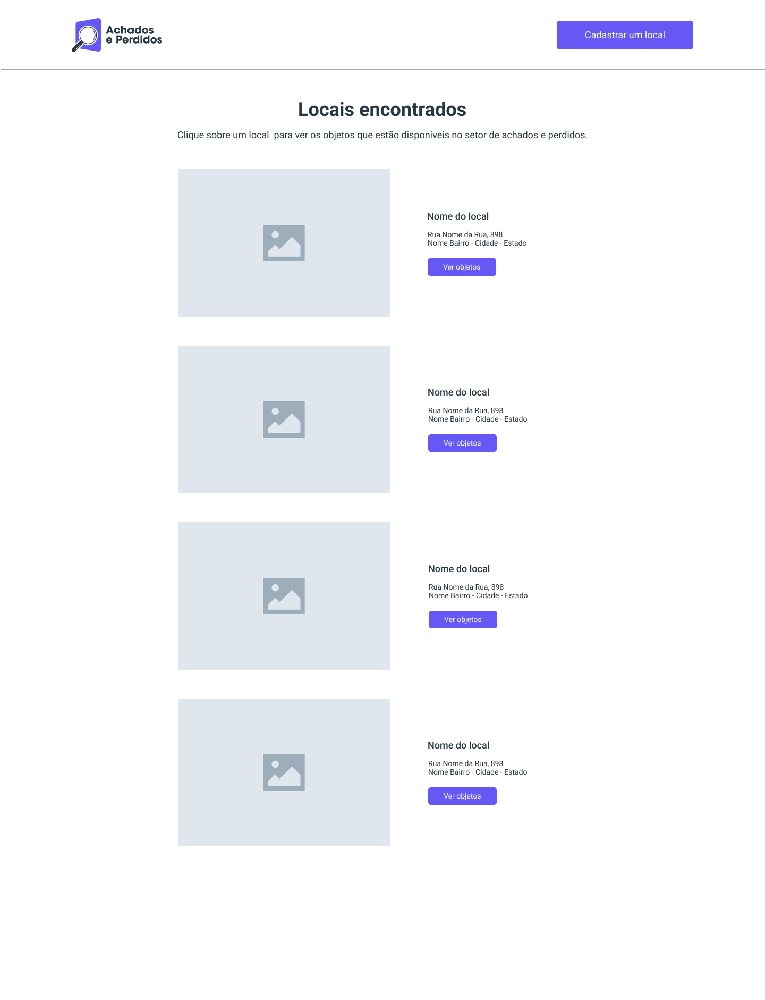
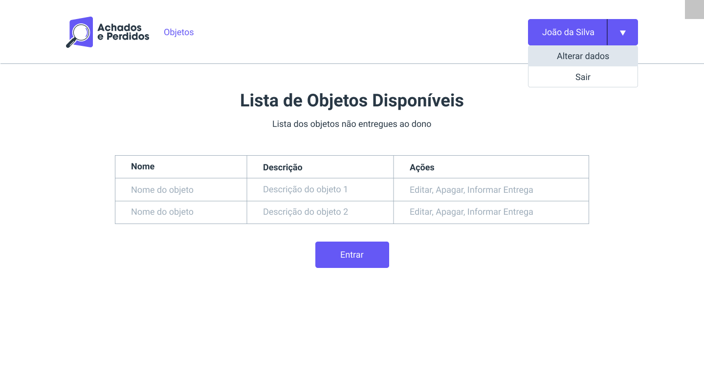
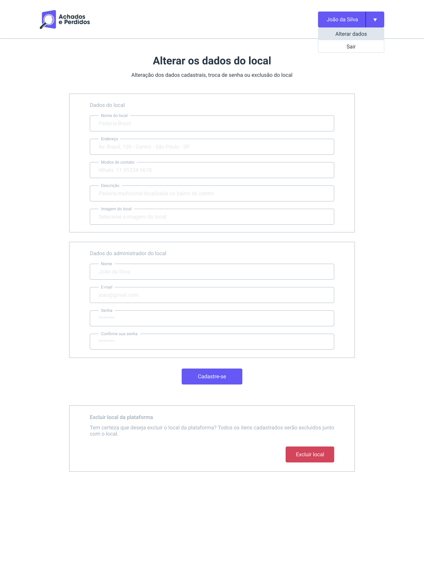

# Achados e Perdidos - Frontend

## Descrição

A aplicação permite que pessoas encontrem seus objetos perdidos de maneira mais fácil, além de facilitar a vida de responsáveis por comércios, condomínios e outros locais públicos que possuem sala de Achados e Perdidos.

#### Clonar o projeto

`git clone https://github.com/eduardobdamacena/achados-perdidos-frontend`

#### Instalar dependências

```bash
npm install
# or
yarn install
```

### Servidor de desenvolvimento

Executar o servidor de desenvolvimento:

```bash
npm run dev
# or
yarn dev
```

Abrir [http://localhost:3000](http://localhost:3000) com o navegador para acessar a página principal.

### Configurar a rota da API do backend

Renomear o arquivo .env.example para .env e colocar o endereço da API do backend.

Obs.: Deixar '/' no final do endereço da API, para não quebrar os links das rotas.

```bash
NEXT_PUBLIC_API="http://localhost:8000/"
```

### Executar o Storybook

Para abrir a documentação dos componentes com Storybook, execute o script:

```bash
start-storybook -p 6006 -s ./public
```

### Tela de listagem de locais



### Tela administrativa - Objetos do local



### Tela alterar dados do usuário


